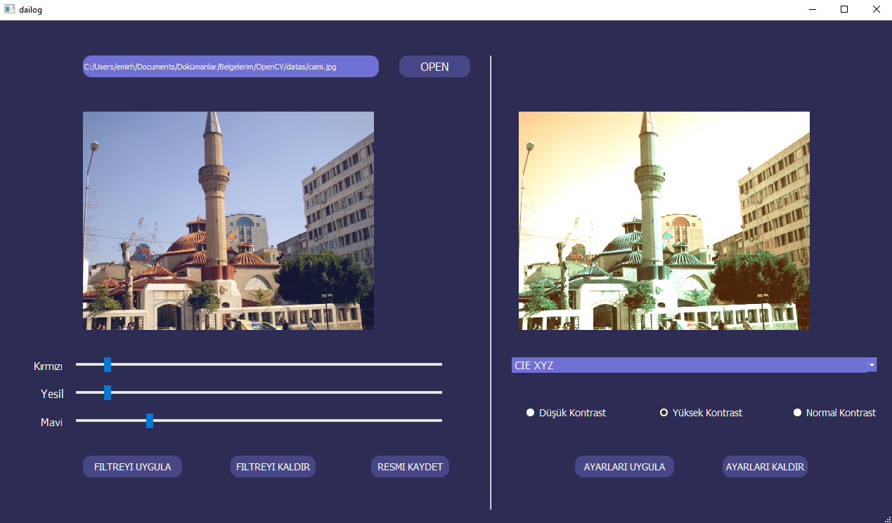

# Image Filter

Bu uygulama OpenCV ile görüntü işleme üzerine geliştirilmiştir. Geliştirilen uygulamanın amacı kullanıcının programa yüklemiş olduğu görselin renk değerlerine göre ve kontrast değerlerine göre düzenlemeler yapabilip, yeni görseli kaydedebilmesidir.

Bu projede renk uzaylarının kullanımı, filtreleme işlemlerinin uygulanması ve görselin renklerinin değiştirilmesi üzerine çalışma yapılmıştır.


[](cover.png)


## Giriş

Geliştirilen programın kullanılması için ilk olarak Qt Creator programının yüklü olması gerekmektedir. Eğer kullanıcılarda bu program yüklü ise direkt olarak çalıştırabilir. 

Programı kullanabilmek için ilk olarak bir görsel öğenin dosya yolunu belirtmeniz gerekecektir. Bunun için 'OPEN' butonuna basarak yüklemek istediğiniz görselin dosya yolunu seçin. Program aşağıdaki görsel tiplerini desteklemektedir.


- Windows bitmaps :  *.bmp, *.dib
- JPEG files : *.jpeg, *.jpg, *.jpe, *.jp2
- Portable Network Graphics : *.png
- Portable Image Format : *.pbm, *.pgm, *.ppm
- Sun rasters: *.sr, *.ras
- TIFF files : *.tiff, *.tif

Seçmek istediğiniz resmin dosya yolunu programa belirttikten sonra görsel soldaki alana yüklenecektir. Görselin altında bulunan track barlar ile görselin renkleri üzerinde oynayabilirsiniz. Örneğin 'Kırmızı' yazan track barı sağa doğru çekerseniz görselinizdeki kırımızı renk yoğunluğu artacaktır. Aynı işlemler diğer iki renk için de geçerlidir. Tüm renkleri aynı anda hareket ettirirseniz görselin parlaklığı artacaktır. Bu özellikleri görsel üzerinde görmek için 'Filtreyi Uygula' butonuna basmanız yeterli olacaktır. Böylece her iki alanda da görselinizin yeni hali gözükecektir.


Eğer görsel üzerindeki renk özellikleri beğenmediyseniz görseli ilk haline geri döndürebilirsiniz. Bunu yapmak için sadece 'Filtreyi Kaldır' butonuna basmalısınız. Görseliniz yüklediğiniz ilk hali gibi ekranda gözükecektir.


Görselinizin şuan ki renk uzayı RGB'dir (Kırmızı-Yeşil-Mavi) . Siz sağ alanda bulunan combo box ile bu renk uzaylarını dilediğiniz gibi değiştirebilirsiniz.

Ayrıca görselinizin kontrast değerini de altta bulunan radio butonları ile değiştirebilirsiniz. Her tıkladığınızda görselin  yeni halini göreceksiniz. Eğer yaptığınız değişiklikleri beğenmezseniz 'Ayarları Kaldır' butonuna basarak yaptığınız tüm değişikleri kaldırarak görselin eski halini almasını sağlayabilirsiniz.

Görsel üzerinde yaptığınız değişiklikler bittiyse artık yeni görseli kayıt edebilirsiniz. Bunun için yapmanız gereken 'Resmi Kaydet' butonuna basmanızdır. Program içerisine belirlediğiniz dosya yolunda ve dosya adına göre kaydeder.  Varsayılan olarak program dosyalarının dizinine kaydetmektedir.


## Notlar


Gereksinimler

````
Qt Creator 4.14.0
OpenCV 4.3.0
C++ 11
````

Eğer OpenCV kurulumunu ' C:/ ' dosya konumundan farklı bir yere yaptıysanız, program dosyalarındaki .pro uzantılı dosyaya giderek kütüphane dosyalarının yollarını kendi dosya yolunuza göre ayarlayın.


## Yazarlar


>  Emirhan KIRAN - [Emir KIRAN](https://www.linkedin.com/in/emir-kiran/)

